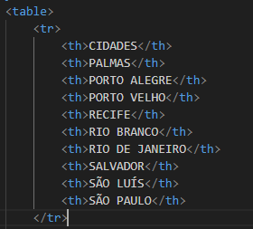
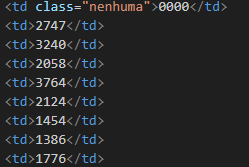
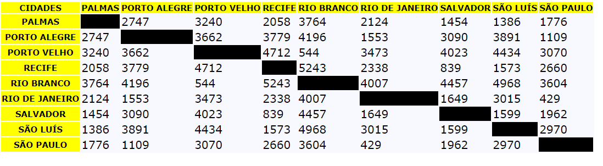

# Projeto - Tabela de distâncias

Projeto criado como parte avaliativa da disciplina de Fundamento de Desenvolvimento Web ministrada pelo professor Leonardo Rocha.

## Índice

* [Descrição](#descrição)
* [Tecnologias](#tecnologias)
* [Referências](#referências)
* [Autor(a)](#autora)

### Descrição

O projeto consiste na composição de uma tabela que conta com capitais brasileiras e a distância entre essas capitais. As capitais constantes nesse projeto são:

* Palmas
* Porto Alegre
* Porto Velho
* Recife
* Rio Branco
* Rio de Janeiro
* Salvador
* São Luís
* São Paulo

### Resultado do Projeto

#### Tabela

* table - Define o início e o fim da tabela.
* tr - Define uma linha da tabela.
* th - São usadas para definir os cabeçalhos das colunas.

Veja uma imagem de parte do código, onde é possível identificar o uso dos elementos mencionados acima:

* td - São usadas para definir o conteúdo das células de dados.

## Tecnologias

* HTML5
* CSS3
* README
* Git
* Github

## Referências

[Alura](https://www.alura.com.br/artigos/escrever-bom-readme) - Como escrever um README incrível no seu Github

## Autor(a)

O projeto foi desenvolvido pelo grupo:

* Ana Julia Oliveira Viana
* Isabelly dos Reis Santos
* Larissa Aparecida Iuski
* Maria Luíza Farias da Silva
* Mariane Lima Remonte Viana
* Vitor Gabriel de Souza
* Vivian Oliveira Almeida